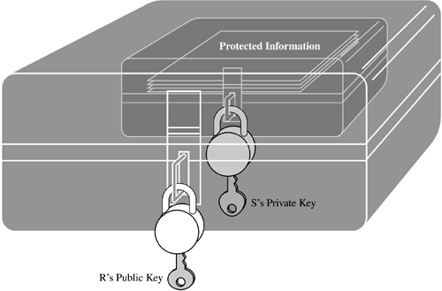

# Asymetric Keys and Certificates

### Combining symmetric and asymmetric encryption often capitalizes on the best features of each.

Four applications of encryption: cryptographic hash functions, key exchange, digital signatures, and certificates.

## Key Exchange

#

## In public-key encryption we need to ensure: 

* Privacy of private Keys
    * To ensure authenticity
    * To prevent the repudiation of digital signatures
* Correct distribuiton of public Keys
    * To ensure confidentiality
    * To ensure the correct validation of digital signatures

* Temporal envolution of entity **(Loss of keys, or generation of new keys)**

* Proper generation of keys (random, efficient but without reducing security)

## Goal
* Key pais generation