# Cryptography

Cryptography is where Security meets Mathematics.

Cryptography refers to the science and art of designing ciphers; cryptanalysis to the science and art of breaking them; while cryptology, often shortened to just crypto, is the study of both. 

**Cipher** -> Specific cryptographic Technique

**Cipher Operation**
* Encrytion: PlainText -> CipherText
* Decryption: CipherText -> PlainText

**Key** -> Algorithm parameter that influences algorithm execution

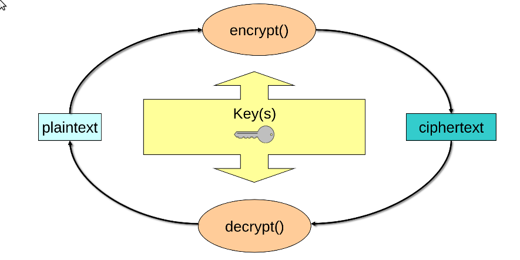


**PlainText Space** -> Possible plaintext Values

**CipherText Space** -> Possible ciphertext Values

**Key Space** -> Possible key Values

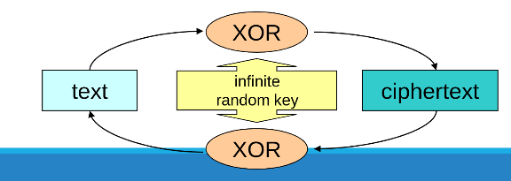


**Goals of Cryptoanalysis**
* Discover Original plainText
* Discover a cipher key
* Discover the cipher algorithm

Types of attacks by Cryptanalists
* Brute Force
    * Exhaustve search
* Clever Attacks
    * Use of dictionaries and potential candidates
    * Identification of patterns


#

**Monoalphabetic substitution** is one the first types of cipher.  A type of substitution ciphers in which the equivalent letters of the plaintext are restored by the same letters of the ciphertext. It is very easily solvable knowing certain things about a language, such as knowing the likelihood of a certain letter.

#

**Symmetric-key algorithms** are algorithms for cryptography that use the same cryptographic keys for both the encryption of plaintext and the decryption of ciphertext.


**Linear-feedback shift register (LFSR)** is a shift register whose input bit is a linear function of its previous state.

**Stream Cipher**  is a symmetric key cipher where plaintext digits are combined with a pseudorandom cipher digit stream (keystream). In a stream cipher, each plaintext digit is encrypted one at a time with the corresponding digit of the keystream, to give a digit of the ciphertext stream. You make the encryption rule depend on a plaintext symbol's position in the stream of plaintext symbols. It can use [LFSR](https://en.wikipedia.org/wiki/Linear-feedback_shift_register) for Random Number generation; [Computerphile Video on LFSR](https://www.youtube.com/watch?v=Ks1pw1X22y4)

[Computerphile Video on HMAC where he explains Stream Ciphers](https://www.youtube.com/watch?v=wlSG3pEiQdc)

**The one-time pad** One way to make a stream cipher of this type proof against attacks is for the key sequence to be as long as the plaintext, and to never repeat. So regardless of the amount of computation opponents can do, they're none the wiser, as given any ciphertext, all possible plaintexts of that length are equally likely. This system therefore has perfect secrecy.

#

**Block Ciphers** is a deterministic algorithm operating on fixed-length groups of bits, called blocks.  See the [PlayFair Table](https://en.wikipedia.org/wiki/Playfair_cipher#:~:text=The%20Playfair%20cipher%20uses%20a%205%20by%205%20table%20containing,table%20and%20use%20the%20cipher.).
Again, it's not enough for the output of a block cipher to just look intuitively “random”. Playfair ciphertexts look random; but they have the property that if you change a single letter of a plaintext pair, then often only a single letter of the ciphertext will change. One consequence is that given enough ciphertext, or a few probable words, the table (or an equivalent one) can be reconstructed 

#

**Hash Functions**, the third classical type of Cipher, evolved to protect the integrity and authenticity of messages. Early uses of these can be seen in baking Test-Keys. **One-way functions** in that although it was possible to compute a test from a message, given knowledge of the key, it was not possible to reverse the process and recover either a message or a key from a single test – the test just did not contain enough information.
This is secure for the same reason the one-time pad is: given any other message  you can find another key  that authenticates  to . So without knowledge of the key, the adversary who sees  and  simply has no information of any use in creating a valid forgery.

#

**Asymmetric primitives** some modern cryptosystems are asymmetric, in that different keys are used for encryption and decryption.

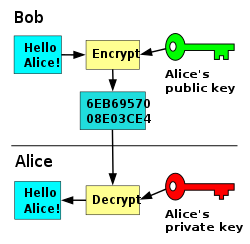


Most web sites nowadays have a certificate containing a public key with which people can encrypt their session using a protocol called TLS; the owner of the web page can decrypt the traffic using the corresponding private key.
Another asymmetric application of cryptography is the digital signature. The idea here is that I can sign a message using a private signature key and then anybody can check this using my public signature verification key. 

#

## Security Models

Security models seek to formalise the idea that a cipher is “good”

**Model of perfect secrecy**: given any ciphertext, all possible plaintexts of that length are equally likely. The best forgery attack on it is a random guess, whose probability of success can be made as low as we want by choosing a long enough tag.

**Model of concrete security**: where we want to know how much actual work an adversary has to do.

**The standard model**  is about ***indistinguishability***. The model of computation in which the adversary is only limited by the amount of time and computational power available. Cryptographic schemes are usually based on complexity assumptions, which state that some problems, such as factorization, cannot be solved in polynomial time. Schemes that can be proven secure using only complexity assumptions are said to be secure in the standard model.

**The random oracle model** is a variation of the standart model. A random oracle is an oracle that responds to every unique query with a (truly) random response chosen uniformly from its output domain. If a query is repeated, it responds the same way every time that query is submitted. If the answer exists, it returns it, if the answer does not exist, it generates a random one.

#
## Properties of Random Functions and PseudoRandom Functions

**Random functions are our model for cryptographic Hash functions.**

```A pseudorandom function will also be a one-way function, provided there are too many possible outputs for the opponent to guess an input that has a desired target output by chance. This means choosing  so that the opponent can't do anything near  computations. If we claim, for example, that SHA256 is a pseudorandom function, then we're saying that there's no practical way to find an input that hashes to a given 256-bit value, unless you knew it already and used it to compute that value.```

* The first main property of a random function is one-wayness.

* A second property of pseudorandom functions is that the output will not give any information at all about even part of the input. 

* A third property of pseudorandom functions with sufficiently long outputs is that it is hard to find collisions. (actually kinda hard, see the [Birthday Paradox](https://en.wikipedia.org/wiki/Birthday_problem)). Historically, the two most common hash functions have been MD5, which has a 128-bit output and will thus require at most  computations to break, and SHA1 with a 160-bit output and a work factor for the cryptanalyst of at most . However, collision search gives at best an upper bound on the strength of a hash function, and both these particular functions have turned out to be disappointing. Nowadays the standart is SHA-256

#

## Public key encryption and trapdoor one-way permutations
Systems that use pairs of related keys. Each key pair consists of a public key and a corresponding private key. In a public-key encryption system, anyone with a public key can encrypt a message, yielding a ciphertext, but only those who know the corresponding private key can decrypt the ciphertext to obtain the original message.

[**Trapdoor one-way permutation**](https://en.wikipedia.org/wiki/Trapdoor_function) -> This is a computation that anyone can perform, but which can be reversed only by someone who knows a trapdoor such as a secret key. (like a hash function should look random and non reversable unless you know the Private Key)

#

## Digital signatures
The basic idea is that a signature on a message can be created by only one principal, but checked by anyone. It can thus perform the same function in the electronic world that ordinary signatures do in the world of paper.

Signature schemes, too, can be deterministic or randomised: in the first, computing a signature on a message will always give the same result and in the second, it will give a different result.

Formally, a signature scheme, **like a public key encryption scheme**, has a keypair generation function which given a random input  will return two keys,  (the private signing key) and  (the public signature verification key).

```
In the general case we do not need message recovery; the message to be signed may be of arbitrary length, so we first pass it through a hash function and then sign the hash value. We need the hash function to be not just one-way, but also collision resistant.
```

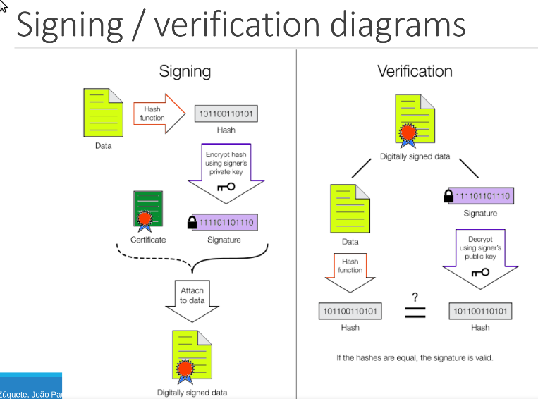

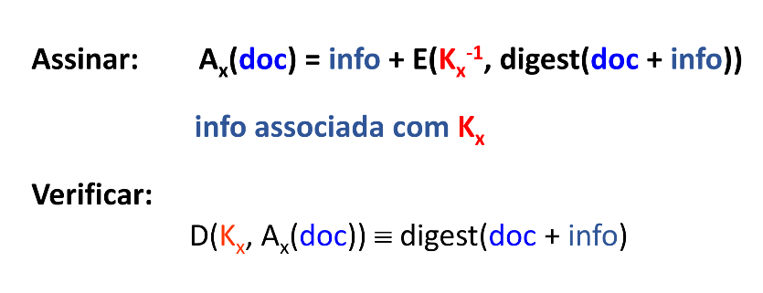

#
## Theoretical Security vs Pratical Security


One-time pad systems are a close fit for our theoretical model, except in that they are used to secure communications across space rather than time: the two communicating parties have shared a copy of a keystream in advance.

```A real problem with keystream generators is to prevent the same keystream being used more than once, whether to encrypt more than one backup tape or to encrypt more than one message sent on a communications channel. During World War II, the amount of Russian diplomatic traffic exceeded the quantity of one-time tape they had distributed in advance to their embassies, so it was reused. But if  and , then the opponent can combine the two ciphertexts to get a combination of two messages: , and if the messages  have enough redundancy then they can be recovered. Text messages do in fact contain enough redundancy for much to be recovered; in the case of the Russian traffic this led to the Venona project in which the US and UK decrypted large amounts of wartime Russian traffic from 1943 onwards and broke up a number of Russian spy rings. In the words of one former NSA chief scientist, it became a “two-time tape”.```

The normal engineering practice is to have not just a key but also a **seed** (also known as an **initialisation vector** or IV) so we start the keystream at a different place each time. The seed  may be a sequence number, or generated from a protocol in a more complex way. 

## Pratical Security
* Security is measured by the computational complexity of break-in attacks
* Security bounds are also taken into consideration
    * Cost of cryptanalysis
    * Availability of cryptanalisis infra-structure
    * Lifetime of cipher Text


### 5 Shannon Criteria of Cryptography
* The ammount of offered secrecy -> key length
* Complexity of key selection -> key generation, detection of weak keys
* Implementing simplicity
* Error Propagation (important for noise channels, radio and such)
* Dimension of ciphertexts


### In cryptography always assume the worst case to ensure more security
* Cryptanalyst know the algorithm (the security is in the key)
* Cryptanalyst know the samples produced (cryptograms are not secret, they have the hashes)
* Cryptanalyst partially or fully know the plaintext that generate the cypher


#

## Symmetric crypto algorithms

* ### SP-networks 
* ### Advanced Encryption Standard (AES)
* ### Feistel ciphers
* ### Data Encryption Standard (DES)

### SP Networks -> [Computerphile Video](https://www.youtube.com/watch?v=DLjzI5dX8jc)
A series of linked mathematical operations used in block cipher algorithms 

Building Block of most Symetric Encryption today

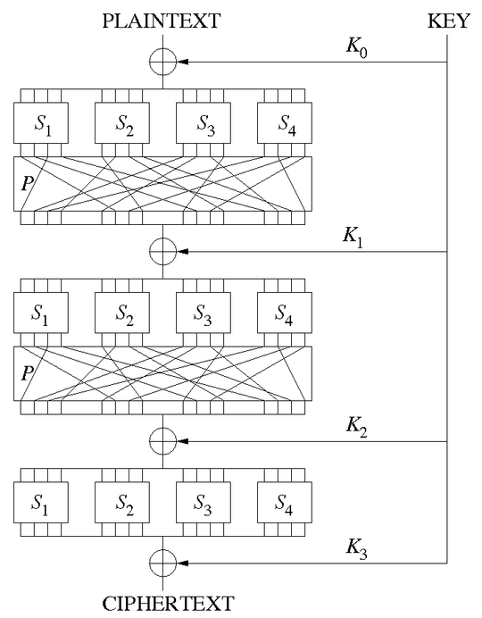


Such a network takes a block of the plaintext and the key as inputs, and applies several alternating rounds or layers of substitution boxes (S-boxes) and permutation boxes (P-boxes) to produce the ciphertext block. The S-boxes and P-boxes transform (sub-)blocks of input bits into output bits. It is common for these transformations to be operations that are efficient to perform in hardware, such as exclusive or (XOR) and bitwise rotation. The key is introduced in each round, usually in the form of "round keys" derived from it. (In some designs, the S-boxes themselves depend on the key.)

Decryption is done by simply reversing the process (using the inverses of the S-boxes and P-boxes and applying the round keys in reversed order).


### AES (Advanced Encryption Standart) -> [Computerphile Video](https://www.youtube.com/watch?v=O4xNJsjtN6E)

It is an SP-network; in order to specify it, we need to fix the S-boxes, the linear transformation between the rounds, and the way in which the key is added into the computation.


AES is actually a standart, soo rounds are implement in hardware itself, witch is much faster and makes sure no one gets the algorithm wrong as well


### Feistel networks [Computerphile Video](https://www.youtube.com/watch?v=FGhj3CGxl8I)

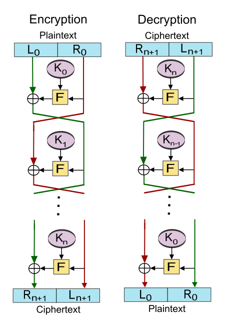

The input is split up into two blocks, the left half and the right half. A round function  of the left half is computed and combined with the right half using exclusive-or (binary addition without carry), though in some Feistel ciphers addition with carry is also used. Then, a function  of the right half is computed and combined with the left half, and so on. Finally (if the number of rounds is even) the left half and right half are swapped.

### Data Encryption Standart (DES)

The Data Encryption Standard is a symmetric-key algorithm for the encryption of digital data. Although its short key length of 56 bits makes it too insecure for modern applications, it has been highly influential in the advancement of cryptography.
This cipher has been superseded by the Advanced Encryption Standard (AES).

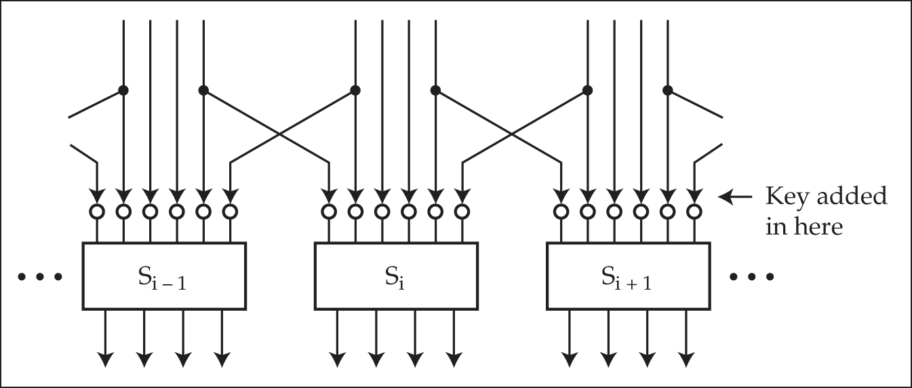

#

## How not to use a block cipher

The next Image shows what happens to a cartoon image when encrypted using DES in ECB mode. Repeated blocks of plaintext all encrypt to the same ciphertext, leaving the image quite recognisable.
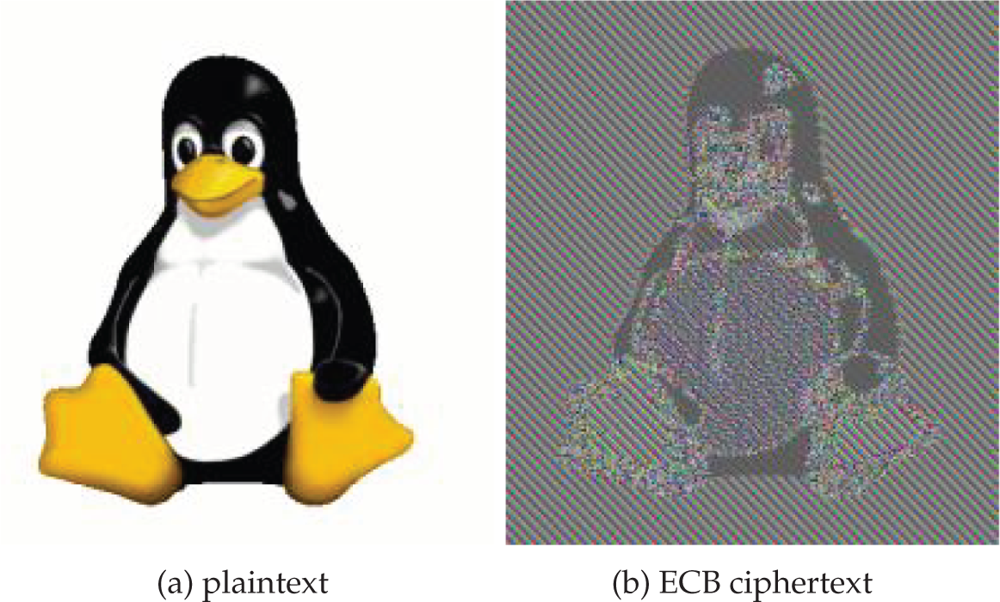


### Cipher block chaining

Most commercial applications which encrypt more than one block used to use cipher block chaining, or CBC, mode. Like ECB, this was one of the original modes of operation standardised with DES. In it, we exclusive-or the previous block of ciphertext to the current block of plaintext before encryption 

This mode disguises patterns in the plaintext: the encryption of each block depends on all the previous blocks. The input initialisation vector (IV) ensures that stereotyped plaintext message headers won't leak information by encrypting to identical ciphertexts, just as with a stream cipher.

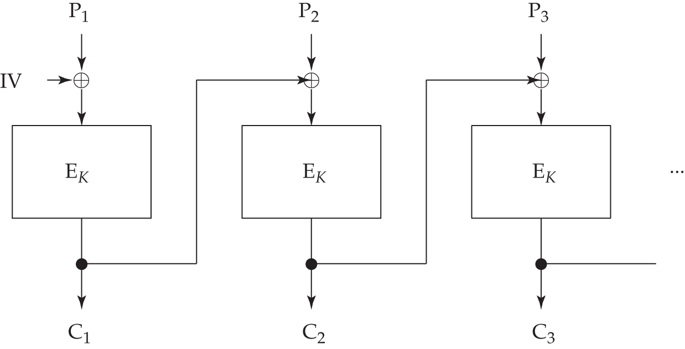

#

## Asymetric Block Ciphers

Use Key Pairs 
* One Private Key -> Personal not Tranmissable
* One Public Key -> Available to all

Allows **Confidentiality without previous exchange of secrets** and **Authentication**(Digital Signature)

**Advantage**
* N peers requiring pairwise, secret interaction only need N key pairs

**Disavantages**
* It usually has a very bad performance

**Problems**
* Distribution of public keys
* Keys must have a lifetime and expire


### Diffie-Hellman key establishment

```

Step 1: Alice and Bob get public numbers P = 23, G = 9

Step 2: Alice selected a private key a = 4 and
        Bob selected a private key b = 3

Step 3: Alice and Bob compute public values
Alice:    x =(9^4 mod 23) = (6561 mod 23) = 6
        Bob:    y = (9^3 mod 23) = (729 mod 23)  = 16

Step 4: Alice and Bob exchange public numbers

Step 5: Alice receives public key y =16 and
        Bob receives public key x = 6

Step 6: Alice and Bob compute symmetric keys
        Alice:  ka = y^a mod p = 65536 mod 23 = 9
        Bob:    kb = x^b mod p = 216 mod 23 = 9

Step 7: 9 is the shared secret.

```
### Security Threat of the Diffie-Hellman

With the Diffie-Hellman protocol there is the possibility of a middleperson attack. Charlie intercepts Alice's message to Bob and replies to it; at the same time, he initiates a key exchange with Bob, pretending to be Alice. He ends up with a key  which he shares with Alice, and another key  which he shares with Bob. So long as he continues to sit in the middle of the network and translate the messages between them, they may have a hard time detecting that their communications are compromised. The usual solution is to authenticate transient keys, and there are various possibilities.


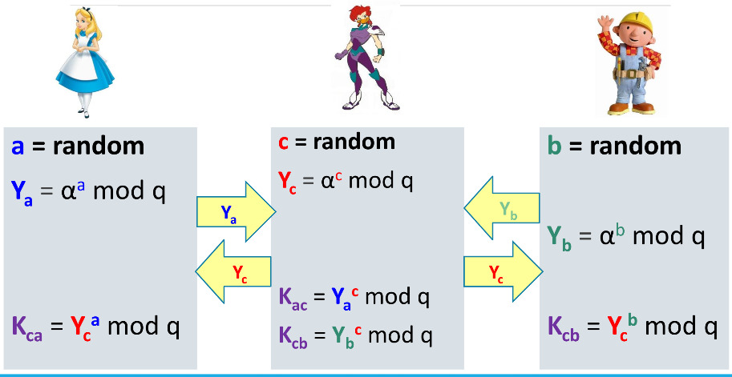

<br>

#

## Hybrid cryptosystem

Hybrid cryptosystem is one which combines the convenience of a public-key cryptosystem with the efficiency of a symmetric-key cryptosystem

Public key algorithms are useful only for specialized tasks because they are very slow. A public key encryption can take 10,000 times as long to perform as a symmetric encryption because the underlying modular exponentiation depends on multiplication and division, which are inherently slower than the bit operations (addition, exclusive OR, substitution, and shifting) on which symmetric algorithms are based. For this reason, symmetric encryption is the cryptographers' “work horse,” and public key encryption is reserved for specialized, infrequent uses, where slow operation is not a continuing problem.


To encrypt a message addressed to Alice in a hybrid cryptosystem, Bob does the following:

```
1-Obtains Alice's public key.
2-Generates a fresh symmetric key for the data encapsulation scheme.
3-Encrypts the message under the data encapsulation scheme, using the symmetric key just generated.
4-Encrypts the symmetric key under the key encapsulation scheme, using Alice's public key.
5-Sends both of these ciphertexts to Alice.
```

To decrypt this hybrid ciphertext, Alice does the following:

```
Uses her private key to decrypt the symmetric key contained in the key encapsulation segment.
Uses this symmetric key to decrypt the message contained in the data encapsulation segment.
```


#

## Hash Functions

**A message digest** is a fixed size numeric representation of the contents of a message, computed by a hash function. Use for digital signatures

**Message Integrity Code** ->
Proides the capability to detect changes by in comunication. If the digest is not the same, something is different in the file

**Message Authentication Code** -> Is a cryptographic checksum on data that uses a session key to detect both accidental and intentional modifications of the data. A MAC requires two inputs: a message and a secret key known only to the originator of the message and its intended recipient.

### Encryption + Authentication 
Encrypt-then-Mac: Mac is computed from cryptogram


#

## Elliptic curve cryptography -> [Computerphile Video](https://www.youtube.com/watch?v=nybVFJVXbww)

We can Generate PseudoRandom numbers and encrypt using Elliptic curve cryptography. The biggest diference is the non-usage of hashFunctions wich in a way gives as more security as some HashFunctions over the years have shown exploits

Discrete logarithms and their analogues exist in many other mathematical structures. Elliptic curve cryptography uses discrete logarithms on an elliptic curve – a curve given by an equation like . These curves have the property that you can define an addition operation on them and the resulting Mordell group can be used for cryptography.

Problems with Eliptic Curves:
* First is Performance, they are much slower than normal hashFunctions.
* The number of bits was very short
* **A Back Door** was possible (thank you CIA)


#

## Digest and Hash Generation from Keys Problems

We need to sometimes generated hashes from a user key like a password or a pin, or a username. Problems with this:

* Keys are not of fixed length, and some algorithms require fixed length
* Diferent Sources (pins, passwords, secrets)
* original source has low entropy; People use the same passwords or don't use random keys.
* If two people have the same password the hash should still be different (this is impossible with one way hash function unless we use Salt)

Ways to solver this:
* passwords must be Stronger(adding other kinds of characters), this will add a lot of complexity to brute force 
* Increasing size of passwords
* Usage of Salt (random string of bits that is used in the hash, this can be stored in plaintext, just makes 2 equal passwords have different hashes)
* One way functions 
* 

[Computerphile Video on Hashing and Salt](https://www.youtube.com/watch?v=8ZtInClXe1Q)


# 

## How strong are asymmetric cryptographic primitives and Quantum Computing
```

When I wrote the first edition of this book in 2000, the number field sieve had been used to attack keys up to 512 bits, a task comparable in difficulty to keysearch on 56-bit DES keys; by the time I rewrote this chapter for the second edition in 2007, 64-bit symmetric keys had been brute-forced, and the 663-bit challenge number RSA-200 had been factored. By the third edition in 2019, bitcoin miners are finding 68-bit hash collisions every ten minutes, RSA-768 has been factored and Ed Snowden has as good as told us that the NSA can do discrete logs for a 1024-bit prime modulus.

There has been much research into quantum computers – devices that perform a large number of computations simultaneously using superposed quantum states. Peter Shor has shown that if a sufficiently large quantum computer could be built, then both factoring and discrete logarithm computations will become easy. So far only very small quantum devices have been built; although there are occasional claims of ‘quantum supremacy’ – of a quantum computer performing a task sufficiently faster than a conventional one to convince us that quantum superposition or entanglement is doing any real work – they seem to lead nowhere. I am sceptical (as are many physicists) about whether the technology will ever threaten real systems. I am even more sceptical about the value of quantum cryptography; it may be able to re-key a line encryption device that uses AES for bulk encryption on a single uninterrupted fibre run, but we already know how to do that.


There is a whole community of physicists working on emergent quantum mechanics – the idea that to make progress beyond the Standard Model, and to reconcile the apparent conflict between quantum mechanics and general relativity, we may need to look at things differently. Meantime, if anyone claims their system is secure ‘because quantum mechanics’ then scepticism may be in order.

If quantum computers ever work, we have other ‘post-quantum’ algorithms ready to go, for which quantum computers give no obvious advantage. In 2020, NIST began the third round of public review of submissions for the Post-Quantum Cryptography Standardization Process. The 65 initial submissions have been cut to 15 through two rounds of review12. One or more algorithms will now be chosen and standardised, so ciphersuites using them could be dropped into protocols such as TLS as upgrades. Many protocols in use could even be redesigned to use variants on Kerberos. If elliptic logarithms become easy, we have these resources and can also fall back to discrete logs in prime fields, or to RSA. But if elliptic logs become easy, bitcoins will become trivial to forge, and the cryptocurrency ecosystem would probably collapse, putting an end to the immensely wasteful mining operations I describe in section 20.7. So mathematicians who care about the future of the planet might do worse than to study the elliptic logarithm problem.

```