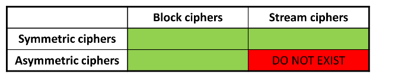

# Cryptography

Cryptography is where Security meets Mathematics.

Cryptography refers to the science and art of designing ciphers; cryptanalysis to the science and art of breaking them; while cryptology, often shortened to just crypto, is the study of both. 

**Cipher** -> Specific cryptographic Technique

**Cipher Operation**
* Encrytion: PlainText -> CipherText
* Decryption: CipherText -> PlainText

**Key** -> Algorithm parameter that influences algorithm execution


**PlainText Space** -> Possible plaintext Values

**CipherText Space** -> Possible ciphertext Values

**Key Space** -> Possible key Values


**Goals of Cryptoanalysis**
* Discover Original plainText
* Discover a cipher key
* Discover the cipher algorithm

Types of attacks by Cryptanalists
* Brute Force
    * Exhaustve search
* Clever Attacks
    * Use of dictionaries and potential candidates
    * Identification of patterns


#

**Monoalphabetic substitution** is one the first types of cipher.  A type of substitution ciphers in which the equivalent letters of the plaintext are restored by the same letters of the ciphertext. It is very easily solvable knowing certain things about a language, such as knowing the likelihood of a certain letter.

#

**Symmetric-key algorithms** are algorithms for cryptography that use the same cryptographic keys for both the encryption of plaintext and the decryption of ciphertext.


**Linear-feedback shift register (LFSR)** is a shift register whose input bit is a linear function of its previous state.

**Stream Cipher**  is a symmetric key cipher where plaintext digits are combined with a pseudorandom cipher digit stream (keystream). In a stream cipher, each plaintext digit is encrypted one at a time with the corresponding digit of the keystream, to give a digit of the ciphertext stream. You make the encryption rule depend on a plaintext symbol's position in the stream of plaintext symbols. It can use [LFSR](https://en.wikipedia.org/wiki/Linear-feedback_shift_register)

**The one-time pad** One way to make a stream cipher of this type proof against attacks is for the key sequence to be as long as the plaintext, and to never repeat. So regardless of the amount of computation opponents can do, they're none the wiser, as given any ciphertext, all possible plaintexts of that length are equally likely. This system therefore has perfect secrecy.

#

**Block Ciphers** is a deterministic algorithm operating on fixed-length groups of bits, called blocks.  See the [PlayFair Table](https://en.wikipedia.org/wiki/Playfair_cipher#:~:text=The%20Playfair%20cipher%20uses%20a%205%20by%205%20table%20containing,table%20and%20use%20the%20cipher.).
Again, it's not enough for the output of a block cipher to just look intuitively “random”. Playfair ciphertexts look random; but they have the property that if you change a single letter of a plaintext pair, then often only a single letter of the ciphertext will change. One consequence is that given enough ciphertext, or a few probable words, the table (or an equivalent one) can be reconstructed 

#

**Hash Functions**, the third classical type of Cipher, evolved to protect the integrity and authenticity of messages. Early uses of these can be seen in baking Test-Keys. **One-way functions** in that although it was possible to compute a test from a message, given knowledge of the key, it was not possible to reverse the process and recover either a message or a key from a single test – the test just did not contain enough information.
This is secure for the same reason the one-time pad is: given any other message  you can find another key  that authenticates  to . So without knowledge of the key, the adversary who sees  and  simply has no information of any use in creating a valid forgery.

#

**Asymmetric primitives** some modern cryptosystems are asymmetric, in that different keys are used for encryption and decryption.


Most web sites nowadays have a certificate containing a public key with which people can encrypt their session using a protocol called TLS; the owner of the web page can decrypt the traffic using the corresponding private key.
Another asymmetric application of cryptography is the digital signature. The idea here is that I can sign a message using a private signature key and then anybody can check this using my public signature verification key. 

#

## Security Models

Security models seek to formalise the idea that a cipher is “good”

**Model of perfect secrecy**: given any ciphertext, all possible plaintexts of that length are equally likely. The best forgery attack on it is a random guess, whose probability of success can be made as low as we want by choosing a long enough tag.

**Model of concrete security**: where we want to know how much actual work an adversary has to do.

**The standard model**  is about ***indistinguishability***. The model of computation in which the adversary is only limited by the amount of time and computational power available. Cryptographic schemes are usually based on complexity assumptions, which state that some problems, such as factorization, cannot be solved in polynomial time. Schemes that can be proven secure using only complexity assumptions are said to be secure in the standard model.

**The random oracle model** is a variation of the standart model. A random oracle is an oracle that responds to every unique query with a (truly) random response chosen uniformly from its output domain. If a query is repeated, it responds the same way every time that query is submitted. If the answer exists, it returns it, if the answer does not exist, it generates a random one.

#
## Properties of Random Functions and PseudoRandom Functions

**Random functions are our model for cryptographic Hash functions.**

```A pseudorandom function will also be a one-way function, provided there are too many possible outputs for the opponent to guess an input that has a desired target output by chance. This means choosing  so that the opponent can't do anything near  computations. If we claim, for example, that SHA256 is a pseudorandom function, then we're saying that there's no practical way to find an input that hashes to a given 256-bit value, unless you knew it already and used it to compute that value.```

* The first main property of a random function is one-wayness.

* A second property of pseudorandom functions is that the output will not give any information at all about even part of the input. 

* A third property of pseudorandom functions with sufficiently long outputs is that it is hard to find collisions. (actually kinda hard, see the [Birthday Paradox](https://en.wikipedia.org/wiki/Birthday_problem)). Historically, the two most common hash functions have been MD5, which has a 128-bit output and will thus require at most  computations to break, and SHA1 with a 160-bit output and a work factor for the cryptanalyst of at most . However, collision search gives at best an upper bound on the strength of a hash function, and both these particular functions have turned out to be disappointing. Nowaday the standart is SHA-256

#

## Theoretical Security vs Pratical Security


One-time pad systems are a close fit for our theoretical model, except in that they are used to secure communications across space rather than time: the two communicating parties have shared a copy of a keystream in advance.

```A real problem with keystream generators is to prevent the same keystream being used more than once, whether to encrypt more than one backup tape or to encrypt more than one message sent on a communications channel. During World War II, the amount of Russian diplomatic traffic exceeded the quantity of one-time tape they had distributed in advance to their embassies, so it was reused. But if  and , then the opponent can combine the two ciphertexts to get a combination of two messages: , and if the messages  have enough redundancy then they can be recovered. Text messages do in fact contain enough redundancy for much to be recovered; in the case of the Russian traffic this led to the Venona project in which the US and UK decrypted large amounts of wartime Russian traffic from 1943 onwards and broke up a number of Russian spy rings. In the words of one former NSA chief scientist, it became a “two-time tape”.```

The normal engineering practice is to have not just a key but also a **seed** (also known as an **initialisation vector** or IV) so we start the keystream at a different place each time. The seed  may be a sequence number, or generated from a protocol in a more complex way. 

## Pratical Security
* Security is measured by the computational complexity of break-in attacks
* Security bounds are also taken into consideration
    * Cost of cryptanalysis
    * Availability of cryptanalisis infra-structure
    * Lifetime of cipher Text


### 5 Shannon Criteria of Cryptography
* The ammount of offered secrecy -> key length
* Complexity of key selection -> key generation, detection of weak keys
* Implementing simplicity
* Error Propagation (important for noise channels, radio and such)
* Dimension of ciphertexts


### In cryptography always assume the worst case to ensure more security
* Cryptanalyst know the algorithm (the security is in the key)
* Cryptanalyst know the samples produced (cryptograms are not secret, they have the hashes)
* Cryptanalyst partially or fully know the plaintext that generate the cypher


# 

## Modern Cyphers

Concerning Operations:
* Block Cyphers
* Stream Cyphers

Concerning Their key:
* Symetric Cyphers
* Asymetric Cyphers



## Symetric Block Cyphers
Usual Approaches
* Large bit blocks
* **Difusion** and **Confusion**