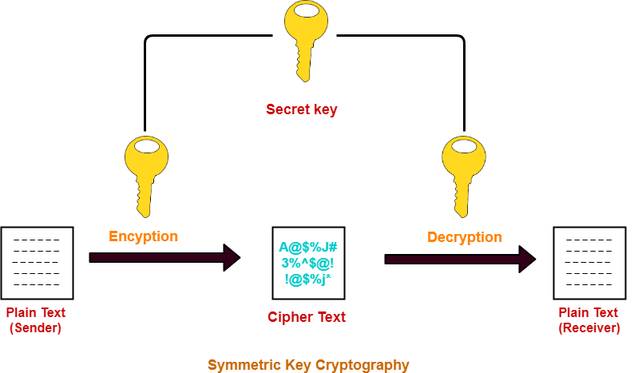

# Cryptography

Cryptography is where Security meets Mathematics.

Cryptography refers to the science and art of designing ciphers; cryptanalysis to the science and art of breaking them; while cryptology, often shortened to just crypto, is the study of both. 

**Cipher** -> Specific cryptographic Technique

**Cipher Operation**
* Encrytion: PlainText -> CipherText
* Decryption: CipherText -> PlainText

**Key** -> Algorithm parameter that influences algorithm execution

**PlainText Space** -> Possible plaintext Values

**CipherText Space** -> Possible ciphertext Values

**Key Space** -> Possible key Values

**Goals of Cryptoanalysis**
* Discover Original plainText
* Discover a cipher key
* Discover the cipher algorithm

Types of attacks by Cryptanalists
* Brute Force
    * Exhaustve search
* Clever Attacks
    * Use of dictionaries and potential candidates
    * Identification of patterns

#

**Monoalphabetic substitution** is one the first types of cipher.  A type of substitution ciphers in which the equivalent letters of the plaintext are restored by the same letters of the ciphertext. It is very easily solvable knowing certain things about a language, such as knowing the likelihood of a certain letter.

#

**Symmetric-key algorithms** are algorithms for cryptography that use the same cryptographic keys for both the encryption of plaintext and the decryption of ciphertext.

**Linear-feedback shift register (LFSR)** is a shift register whose input bit is a linear function of its previous state.

**Stream Cipher**  is a symmetric key cipher where plaintext digits are combined with a pseudorandom cipher digit stream (keystream). In a stream cipher, each plaintext digit is encrypted one at a time with the corresponding digit of the keystream, to give a digit of the ciphertext stream. You make the encryption rule depend on a plaintext symbol's position in the stream of plaintext symbols. It can use [LFSR](https://en.wikipedia.org/wiki/Linear-feedback_shift_register)

**The one-time pad** One way to make a stream cipher of this type proof against attacks is for the key sequence to be as long as the plaintext, and to never repeat. So regardless of the amount of computation opponents can do, they're none the wiser, as given any ciphertext, all possible plaintexts of that length are equally likely. This system therefore has perfect secrecy.

#

**Block Ciphers** is a deterministic algorithm operating on fixed-length groups of bits, called blocks.  See the [PlayFair Table](https://en.wikipedia.org/wiki/Playfair_cipher#:~:text=The%20Playfair%20cipher%20uses%20a%205%20by%205%20table%20containing,table%20and%20use%20the%20cipher.).
Again, it's not enough for the output of a block cipher to just look intuitively “random”. Playfair ciphertexts look random; but they have the property that if you change a single letter of a plaintext pair, then often only a single letter of the ciphertext will change. One consequence is that given enough ciphertext, or a few probable words, the table (or an equivalent one) can be reconstructed 

#

**Hash Functions**, the third classical type of Cipher, evolved to protect the integrity and authenticity of messages. Early uses of these can be seen in baking Test-Keys. **One-way functions** in that although it was possible to compute a test from a message, given knowledge of the key, it was not possible to reverse the process and recover either a message or a key from a single test – the test just did not contain enough information.
This is secure for the same reason the one-time pad is: given any other message  you can find another key  that authenticates  to . So without knowledge of the key, the adversary who sees  and  simply has no information of any use in creating a valid forgery.

#

**Asymmetric primitives** some modern cryptosystems are asymmetric, in that different keys are used for encryption and decryption.

Most web sites nowadays have a certificate containing a public key with which people can encrypt their session using a protocol called TLS; the owner of the web page can decrypt the traffic using the corresponding private key.
Another asymmetric application of cryptography is the digital signature. The idea here is that I can sign a message using a private signature key and then anybody can check this using my public signature verification key. 

#

## Security Models