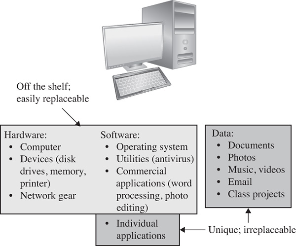
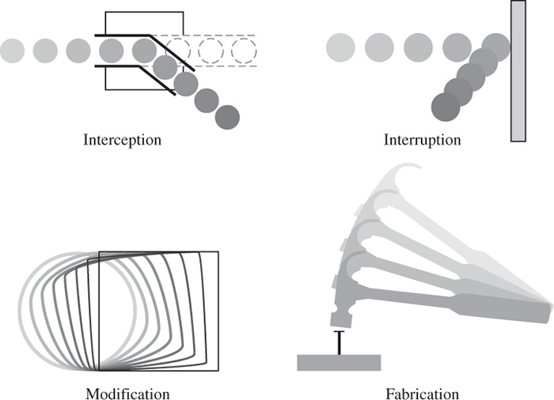
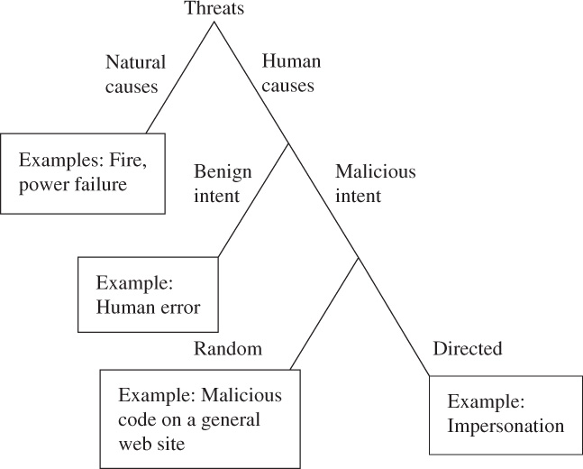
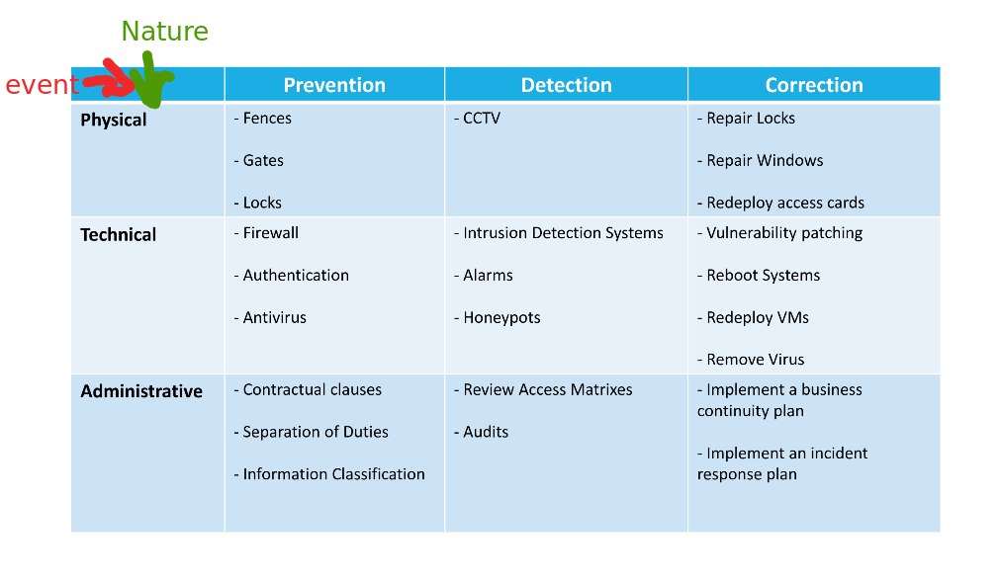
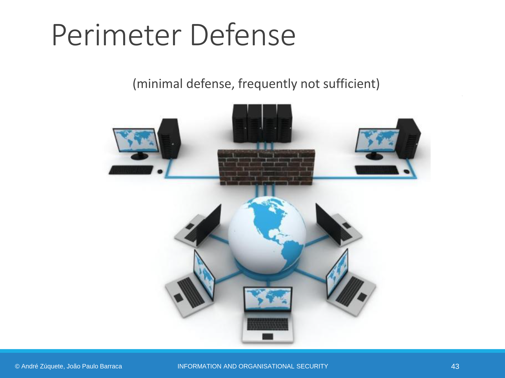
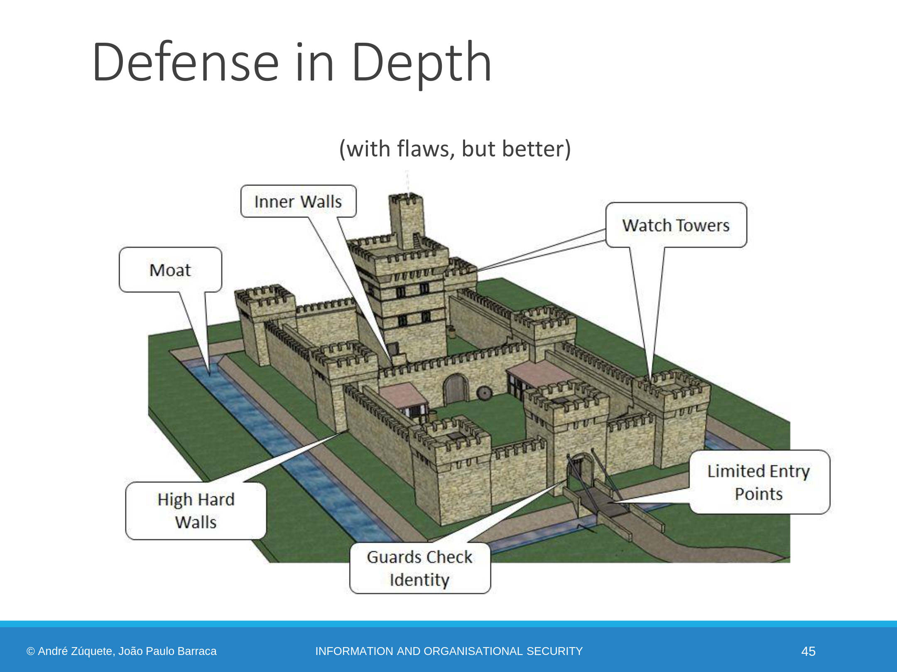
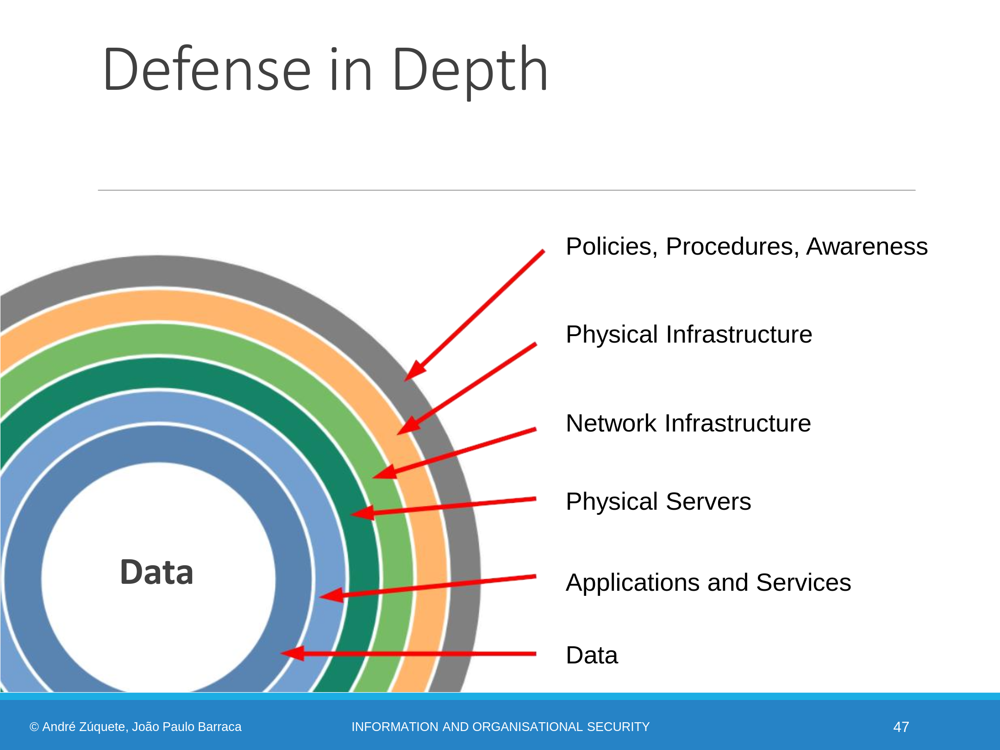

# Course focused on Security in many diferent aspects of the develpment life-cycle

* **Planning** -> Design of a solution complying with some requirments under a normative context, this is: Planning needs to follow an international standard on how to manage information security. 
* **Development** -> Implement solutions complying with the design, without bugs wich comprimise the correct execution. Requires careful implementation and tests
* **Execution** -> Code executes as written, envirment is controlled: cannot be manipulated or observed
* Processes
* **People** -> Staff behavior cannot have a negative impact on the solution. There must be norms in place (ex: clean desk policy), Staff musr be trained
* Clients and Supply Chain
* Mechanism
* Standarts and Laws
* Intelectual property
* **Analysis and Auditing** -> Identify deviations from the expected behaviour of the solution. Identify deviations, identify risk, identefy the impact of losses of C-I-A

## Perpectives of Security

**Defensive**: Focus on maitaining predictability

**Offensive**: Focus on exploiting presictability

**Other**: 
* Reverse engineering
* Forensics
* Disaster Recovery
* Auditing

#

We will talk about security of computers, their data, and the devices and objects to which they relate. In this book you will learn some of the ways computers can fail (or be made to fail) and how to protect against those failures. 

## What Is Computer Security

Computer security is the protection of the items you value, called the **Assets** of a computer or computer system.

**Hardware, software, and data—have value and deserve security protection.** 

### **Value**

The value of an asset depends on the asset owner’s or user’s perspective. Assets’ values are personal, time dependent, and often imprecise.

Much hardware and software is off-the-shelf, meaning that it is commercially available (not custom-made for your purpose) and that you can easily get a replacement.

The thing that makes your computer unique and important to you is its content: photos, tunes, papers, email messages, etc.

#

## The Vulnerability–Threat–Control Paradigm

The goal of computer security is protecting valuable assets. To study different ways of protection, we use a framework that describes how assets may be harmed and how to counter or mitigate that harm.

## Vulnerability

**A vulnerability is a weakness that could be exploited to cause harm.**

A vulnerability is a weakness, flaw or other shortcoming in a system (infrastructure, database or software), but it can also exist in a process, a set of controls, or simply just the way that something has been implemented or deployed.

## Threat 

**A threat is a set of circumstances that could cause harm.**

In cybersecurity, the most common understanding of a threat is anything that could exploit a vulnerability, which could affect the confidentiality, integrity or availability of your systems, data, people and more. 

There are many threats to a computer system, including human-initiated and computer-initiated ones. We have all experienced the results of **inadvertent human errors, hardware design flaws, and software failures**. But **natural disasters are threats**, too; they can bring a system down when the **computer room is flooded or the data center collapses from an earthquake**, for example.

## Attack
**A human who exploits a vulnerability perpetrates an attack on the system. An attack can also be launched by another system.**

## Risk

**Risk is the probability of a negative (harmful) event occurring as well as the potential of scale of that harm**. Your organizational risk fluctuates over time, sometimes even on a daily basis, due to both internal and external factors.

***Risk = threat x vulnerability***
This is another way of looking at risk, albeit a bit simplified.

## Control or CounterMeasures

**Controls prevent threats from exercising vulnerabilities.**

We use control or countermeusures as protection. A control is an action, device, procedure, or technique that removes or reduces a vulnerability

 

### A threat is blocked by control of a vulnerability

#

##  C-I-A triad
## Confidentiality Integrity Availability

* availability: the ability of a system to ensure that an asset can be used by any authorized parties

* integrity: the ability of a system to ensure that an asset is modified only by authorized parties

* confidentiality: the ability of a system to ensure that an asset is viewed only by authorized parties

**authentication**: the ability of a system to confirm the identity of a sender

**nonrepudiation or accountability**: the ability of a system to confirm that a sender cannot convincingly deny having sent something

**privacy**: how personal data is handled
* Aquired
* Processed
* Stored
* Shared
* Deleted

# 
## Information Security Measures

### Confidentiality
* Encrypt Information
* Use Access passwords (strong)
* Use Identity Managment and Authentication Systems
* Doors, Strong Walls
* Training (human training)

### Integrity
* Indentity control
* Backups
* Access Controls
* Robust Storage Devices
* Data Verification Processes

### Availability
* Backups 
* Disaster Recovery plans
* Redundancy
* Virtualization
* Monitoring

### Privacy
* Access Control
* Transparent Processes
* Ciphers
* Integrity and Authentication Controls
* Logs

# 

### Harm to Assets
The C-I-A triad can be viewed from a different perspective: the nature of the harm caused to assets. Harm can also be characterized by four acts: interception, interruption, modification, and fabrication. 

 

#

**Computer security seeks to prevent unauthorized viewing (confidentiality) or modification (integrity) of data while preserving access (availability).** 

#

## Types of Threats

**Threats are caused both by human and other sources.**

### Threats can be malicious or not.

* **Nonmalicious kinds** of harm include someone’s accidentally spilling a soft drink on a laptop, unintentionally deleting text, inadvertently sending an email message to the wrong person
* **Malicious Threats** - Most computer security activity relates to malicious, human-caused harm. 

### Malicious Attacks

Malicious attacks can be **random** or **directed**

* **Random** - In a random attack the attacker wants to harm any computer or user; such an attack is analogous to accosting the next pedestrian who walks down the street. An example of a random attack is malicious code posted on a website that could be visited by anybody.

* **Directed** - The attacker intends harm to specific computers, perhaps at one organization or belonging to a specific individual

Although the distinctions shown in Figure seem clear-cut, sometimes the nature of an attack is not obvious until the attack is well underway, or perhaps even ended. 

No one can show you how many kinds of attacks can harm your assets, there are just to many ways, and sometimes, unknown ways that you may not even be documented yet. 
However we can still try to use [**CVE**](https://cve.mitre.org/) (Common Vulnerabilities and Exposures) and [**CVSS**](https://nvd.nist.gov/vuln-metrics/cvss) ( Common Vulnerability Scoring System) 

#

## Advanced Persistent Threat

Advanced persistent threat attacks come from organized, well financed, patient assailants. Often affiliated with governments or quasi-governmental groups, these attackers engage in long term campaigns. (please CIA get out of my walls). Typically the attacks are silent, avoiding any obvious impact that would alert a victim.

Take long time, can have many long steps of attack before something is noted of harm actually begins to be inflicted

One popular objective is **economic espionage**. 

# 

## Types of Attackers

**No one pattern matches all attackers.**

However some distinctions can be made:

* Individuals
* Organized, Worldwide Groups
* Organized Crime

#

## Security Objectives
The objective of Information Security is to prevent damages. They can come from
* **Catastrophic Events**
    * Natural Phenomena
    * Abnormal Temperature, litning, fires, floods
* **Degradation of computer hardware**
    * bad sectors in disk
    * failures in power suplies
    * bit erros in RAM or SSD
* **Defense against ordinary failures**
    * Power outages
    * Sytems Failures (Windowns blue screens, kernel crashes, Deadlocks)
    * Software Faults
* **Defense against non-Authorized activities**
    * Initiated by someone "from the outside" or "from inside"
        * Information Access
        * Information Alteration
        * Resource usage
        * Denial of Service
        * Vandalism

#

## Security Core Concepts

* **Domains**
* **Policies**
* **Mechanisms**
* **Controls**

### **Domains**
A set of entities sharing similar security attributes

Allow Managing security in an aggregated manner. Domains can be organized in a flat or hierarchical manner

### **Policies**

A set of guidelines related to security, that rule over a domain

Organizations will contain multiple policies, applicable to each specific domain

* Define the power of each user/subject
* Define security procedures (who does what)
* Define the minimun security requirments (security levels, security groups, required authorazation)
* Define defense strategies and fight back tatics (defensive architecture)
* Define what are legal and illegal activities

### **Mechanisms**

Mechanisms implement Policies

### **Controls**

Controls are any aspect allowing to minimize risk (protect the CIA properties)

Include 
* Policies
* Mechanisms
* Standarts
* Processes
* Techniques

**Types of security Controlls**

* Prevention
* Detection
* Correction

#
## Pratical Security

### Perfect Security is Impossible.

 

* We then must focus on the most probable events
* Consider cost and profit
* Consider all Domains and Entities
* Consider impact
* Consider Cost of Recovery and time
* Charecterize the attacker
* Consider that the system will eventually be comprimised (Have recovery plans)

## Complex Problems
* Computers are very fast and much damage can be caused in a very short period of time
* The number of weakness is always growing
* Networks allow a lot of mechanisms
    * anonymity
    * fast spread accross geological boundaries
* Complex Attack Chains
* Users are mostly unaware of the risks
* Users don't care

#

## Some Defense Mechanims

* **Perimeter Defense** -> Protection against external Users

    

    
    

* **Depth Defense** -> Protection agains external and internal attackers. Assumes well defined domains accross the Organization

    

    
    

    

    
    

* **Zero Trust** -> There is no inherant trust just because entities are internal. No notion or diference between internal and external entities. What all systems should use nowadays
    * Authenticate and Authorize everywhere
    * Don't trust any network